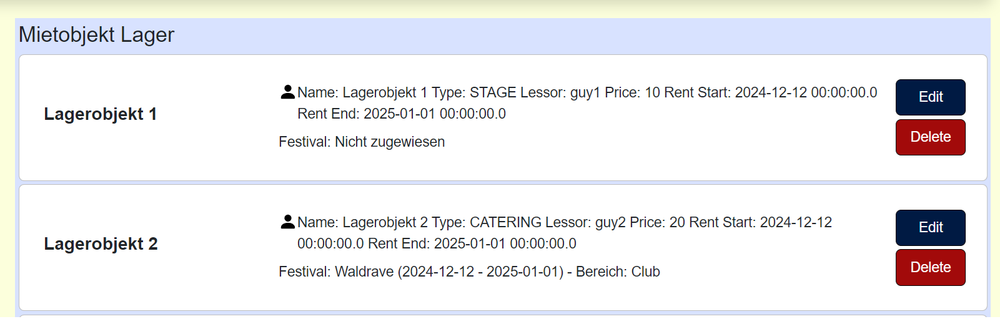

= Cross-Testing Feedback

__Durchführende Gruppe: 07__ +
__Anwendung von Gruppe: 04__

== Getestetes System
Die Software soll als zentrale Hilfsanwendung für die Planung, Organisation, Durchführung und Auswertung von Festivals dienen. Ziel ist es, den zeitlichen Aufwand, die Planungskosten sowie die Fehlerquote bei der Organisation solcher Veranstaltungen signifikant zu reduzieren. Die Anwendung richtet sich an Veranstalter, die durch eine verständliche und übersichtliche Benutzeroberfläche effizient arbeiten möchten.

Konkret ermöglicht die Software den Nutzern, geeignete Locations für Festivals auszuwählen und die Veranstaltungen auf eine strukturierte und benutzerfreundliche Weise zu planen. Dies schafft eine optimale Basis für den Austausch mit Kunden, die detaillierte Entwicklung des Produkts und eine erfolgreiche Abnahme.

== Fehler-Report
// See http://asciidoctor.org/docs/user-manual/#tables
[options="header"]
|===
|Pfad |Parameter |Beschreibung |Rückgabe

|PaulPlant32 -> Lager -> Ein Lagerobjekt editieren -> Seite zur Bearbeitung 
|Objekt: "Stage 1", Gemietet von: 24-12-2024, Gemietet bis: 25-12-2024 
|Gemietet von und bis angeben, sodass das Objekt schon in dem Zeitfenster vermietet sein soll. Da das Inputfeld beim Öffnen immer leer ist und es keine Infos über bestehende Vermietungen des Objektes gibt, kann es durchaus passieren.
|"Whops, there was an Error!"

|PaulPlant32 -> Neues Festival erstellen 
| Location: Wald, von: 13.12.2024, bis: 14.12.2024 
|Datum von und bis angeben, sodass die Location an den Tagen besetzt ist. 
|"Whops, there was an Error!"

|PaulPlant32 -> Lager -> Ein Lagerobjekt editieren -> Seite zur Bearbeitung 
|Vertrag hochladen: eine .PNG Datei
|Wenn der Vertrag in Form von .PNG ist, bekommt man einen Fehler. Sollte es nur PDFs zur Auswahl erlauben?
|"Whops, there was an Error!"

|PaulPlant32 -> Lager -> Ein Lagerobjekt editieren -> Seite zur Bearbeitung 
|Vertrag hochladen: eine .PDF Datei
|Wenn der Vertrag in Form von .PDF ist, bekommt man einen Browser-Fehler (in Edge und Brave).
|"Die Website ist nicht erreichbar. Verbindung wurde zurückgesetzt. Versuche Folgendes:
Verbindung prüfen, Proxy und Firewall prüfen +
ERR_CONNECTION_RESET"

|ManManager -> Festivals -> Waldrave -> Lageplan hochladen
|Datei: eine .PNG Datei
|Die Funktionalität geht nicht.
|Zurück zu http://localhost:8080/map/UUID +
In der Konsole: +
java.io.IOException: java.io.FileNotFoundException: +
C:\Users\myusr\Desktop\crosstesting\ + 
src\main\resources\static\resources\uploadFiles\ +
54c5394e-57c5-4559-b996-f252d2c973b8.png +
(Das System kann den angegebenen Pfad nicht finden)

|Cat6 -> Ein Produkt hinzufuegen -> Verkaufen 
|Produkt: 1 "Pizza"
|Wenn etwas verkauft wird, passiert nichts
|-

|Verkaufsmitarbeiter -> Ticket erstellen, Sicherheitspersonal -> Gültigkeit prüfen
|
|Verkaufsstatus: GESCHLOSSEN und kann nicht ein Ticket erstellen oder Gültigkeit prüfen
|

|Festivalbesucher -> Festivalgelände, Spielplan
|
|Es gibt keine Fistivals um zu testen
|

|PaulPlant32 -> Meerfest -> Location ändern
|Parametr: Wald
|Muss-kriterien N.2.1.2: "...Hierbei soll keine Doppelbelegung einerLocation möglich sein...". Es gibt shoen "Waldrave" mit Location "Wald".
|-

|===

== Optik der Anwendung
- Der Header der Webseite ist nicht bündig mit der oberen Fensterkante. Es wird empfohlen, das Top-Padding des Headers zu entfernen, um ein einheitliches und vertrautes Erscheinungsbild zu gewährleisten. 
- Darüber hinaus finden wir, dass der Header kleiner gemacht werden soll, um mehr Platz für Content-Body zu schaffen. 

== Fehlende Features
- Aus Beglietheft: +
"Aufgrund der nicht rechtzeitigen Fertigstellung beziehungsweise möglicherweise entstandener Bugs wird die Zuordnung von des Stundenlohnes und der Arbeitsstunden pro Festival für Personen, also die Zuordnung der Bezahlung zu Festivals, vorenthalten."

- Lageplan zum Festival kann nicht hochgeladen werden (s. Fehlerreport No.5).

== Interaktion mit der Anwendung (Usability)
- Zu grobe Fehlermeldung bei den unpassenden Daten (beim Erstellen von einer neuen Lokation).

- Die Seite, auf die der Button "Edit" für Mietobjekte führt, heißt "Neues Mietobjekt", obwohl es kein an sich "neues" Objekt ist.

- In derselben Seite wird nicht ausgeführt, wo das Objekt bereits verwendet wird (auf welchem Festival/Bereich). Sonst wäre es nutzerfreundlicher.

- Man bekommt diese Meldungen, wenn man ein Festival überarbeitet. Um es zu erfahren, muss man die Nachrichten nachschauen.

- Die Lagerobjektbeschreibung ist reiner Text, also sehr unübersichtlich.

- Die Seite "Location bearbeiten" hat keine Beschreibung von Feldern, die man bearbeiten kann. Somit sind die Daten schwer ablesbar.

- Die Spalte "Bereiche" in Festivaldetailübersicht trägt keine (offensichtliche) Information.

- Der Text hier lädt sich nicht korrekt in der Tabelle in Mietobjekten der Festival.

== Verbesserungsvorschläge
* Was kann noch weiter verbessert werden?

