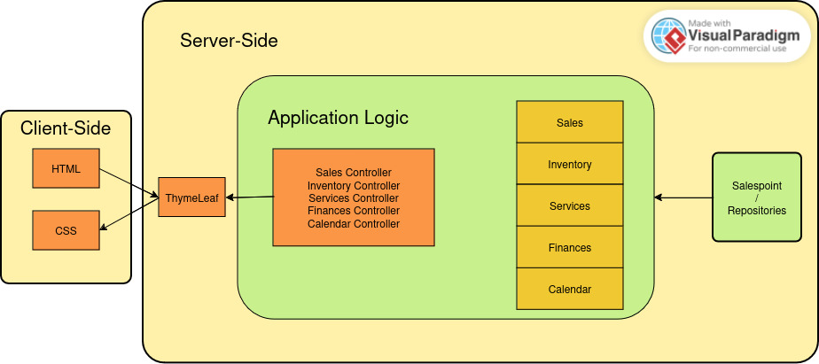
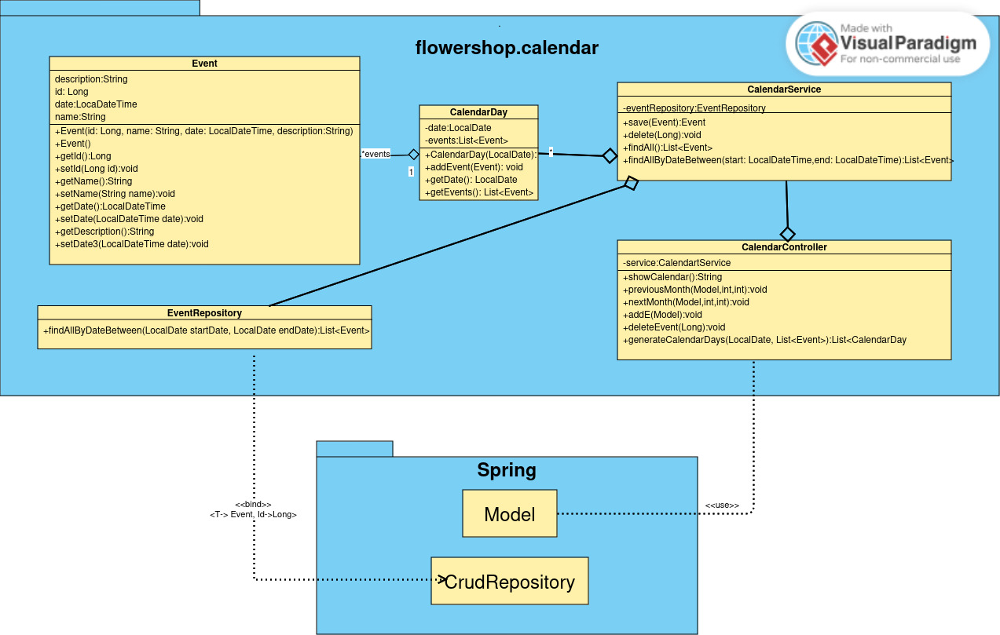

= Entwicklerdokumentation
:project_name: name-des-projekts
:toc: left
:numbered:

[options="header"]
[cols="1, 1, 3, 3"]
|===
|Version | Datum   | Autor | Beschreibung
|0.1	| 15.11 | Andrejs | Package Diagram + External Dependencies
|0.2	| 18.11 | Oleh | Start of package diagram for sales package
|0.3	| 18.11 | Andrejs | Vorgaben zum Betrieb der Software
|0.4	| 19.11 | Oleh | Kontextdiagramm
|...	| ... | ... | ...
|===

== Einführung
* Aufgabenstellung

== Randbedingungen
=== Hardware-Vorgaben

[cols="1, 1"]
|===
|Maus	| Benutzer 
|Tastatur	| Benutzer 
|Rechner mit Internetverbindung | Benutzer
|Server mit Linux	| Unternehmen
|===

=== Software-Vorgaben

The following (or newer) Java version is necessary to run the application:

[cols="1"]
|===
|Java 21
|===

The following (or newer) browser versions are necessary to use the application:
[cols="1, 1"]
|===
|Firefox |130.0.0
|Google Chrome |131.0.0
|Chromium based browsers |130.0.0
|Opera |114.0.0
|Safari |18.0
|===

=== Vorgaben zum Betrieb der Software
Das Program soll in dem Blumenladen intern (d.h. von den Mitarbeitern) bedient werden, um die Geschäftsprozesse (u.a. Verkauf, Einkauf, Bluemnpflegen-Dienstleistungen usw.) zu digitalisieren und vereinfachen. 

Das Backend soll auf einem Server mindestens in Arbeitszeiten (oder länger) laufen und mittels des Netzwerkes zugänglich für Enduser-Rechener sein.

Die Nutzer sind Frau Floris (Besitzerin) und ihre Nichte (Mitarbeiterin im Service). Es wird vorausgesetzt, dass sie den Rechner im Wesentlichen bedienen können.  

Das System soll keiner technischen Wartung bedürfen. Sämtliche Daten sollen persistent in einer Datenbank gespeichert und über die Anwendung zugänglich sein (z.B. sollten für Frau Floris keine SQL-Kenntnisse erforderlich sein).

== Kontextabgrenzung

[[context_diagram]]
image::./models/images/context_diagram_dd_a.svg[context diagram, 100%, 100%, pdfwidth=100%, title= "Kontextdiagramm für Blumenladen in C4", align=center]

== Lösungsstrategie
=== Erfüllung der Qualitätsziele
[options="header"]
|=== 
|Qualitätsziel |Lösungsansatz
|Verfügbarkeit a|
* Nutzen Sie einen globalen Fehlerbehandlungsmechanismus mit @ControllerAdvice in Spring, um alle möglichen Fehler abzufangen und benutzerfreundliche Fehlermeldungen zurückzugeben.
* Verhindern von Unterbrechungen der Geschäftsprozesse, um Umsatzverluste und Kundenunzufriedenheit zu vermeiden. Alle möglichen Fehler müssen abgefangen und richtig behandelt werden.
* Lagern Sie kritische statische Dateien wie Bilder, CSS und JS lokal auf dem Server, um die Abhängigkeit von externen Diensten zu reduzieren.
|Leistungsfähigkeit a|
* Vermeiden Sie redundante Logik in Controllern und Services. Jede Funktion sollte nur einmal in der entsprechenden Schicht implementiert sein, um den Overhead zu reduzieren.
* Entfernen Sie nicht benötigte Abhängigkeiten und Module aus der Spring-Konfiguration, um die Startzeit der Anwendung zu verkürzen und Ressourcen zu sparen.
* Reduzieren Sie den Overhead durch klare Trennung der Controller-Logik. Z. B. sollte ein Controller nur eine kleine Menge an Logik ausführen und ansonsten auf Services delegieren, um die Performance nicht zu beeinträchtigen.
|Benutzerfreundlichkeit a|
* Nutzen Sie Thymeleaf-Layouts (layout:decorator), um ein einheitliches Erscheinungsbild auf allen Seiten zu gewährleisten.
* Sie müssen sicherstellen, dass der Stil der Anwendung auf allen Seiten gleich ist, um den Lernaufwand zu minimieren.
* Der Benutzer sollte von jedem Punkt der Anwendung aus zu einem anderen Funktionsbereich wechseln können (z. B. von den Services zum Lagerbestand usw.).
* Schützen Sie den Benutzer vor Fehlern. Ungültige Eingaben dürfen nicht zu ungültigen Systemzuständen führen.
|Sicherheit a|
* Stellen Sie sicher, dass nur die Personen auf die Daten zugreifen können, die dazu berechtigt sind. Dies kann mit Spring Security und Thymeleaf (sec:authorize - Tag) realisiert werden.
* Verhindern Sie die unbefugte Änderung von Daten. Dies kann mit Spring Security (@PreAuthorize - Annotation) realisiert werden.
* Rückverfolgbarkeit von Aktionen oder Ereignissen zu einer eindeutigen Entität oder Person. Für diese Anwendung sollte jede Bestellung mit einem Kunden verknüpft sein.
|Wartbarkeit a|
* Entwickeln einer modularen Architektur, die mit minimalem Aufwand angepasst und erweitert werden kann.
* Dokumentieren des Codes sorgfältig, um eine kosteneffiziente langfristige Wartung zu ermöglichen.
* Sicherstellen, dass die Anwendung modifiziert oder erweitert werden kann, ohne dass Fehler auftreten oder die Produktqualität beeinträchtigt wird.
* Testabdeckung: Schreiben Sie Unit-Tests für kritische Logik mit JUnit.
|===

=== Softwarearchitektur
* Beschreibung der Architektur anhand der Top-Level-Architektur oder eines Client-Server-Diagramms

HTML-Templates werden auf dem Server gerendert von Controllers und im Client angezeigt, dabei werden sie mit CSS gestylt.
Thymeleaf übernimmt das Rendering und fügt dynamisch die Daten ein, die von den serverseitigen Controllern bereitgestellt werden.
Diese Controller – wie Sales, Inventory, Services, Finances und Calendar – rufen Daten über Modellklassen ab und verwalten sie.
Die Daten werden über Repository-Klassen gespeichert, die im Diagramm als *„Salespoint / Repositories“* gekennzeichnet sind.
Die Datenbank wird über JPA und Hibernate angesprochen, die die Daten in der Datenbank speichern und abrufen.

=== Entwurfsentscheidungen

==== Verwendete Muster
* Spring MVC

==== Persistenz
==== Benutzeroberfläche

=== Use of external frameworks

NOTE: Name the used external frameworks, in which packages you used them, and why you used them in your application. You only need to describe the high level artifact.

[options="header"]
|===
|Exterenes Framework|Kategorie|Beschreibung
|Spring Boot |General purpose |Vereinfacht die Entwicklung eigenständiger, produktionsreifer Anwendungen auf Basis von Spring.
|Spring Data JPA |Persistence |Verwaltet den Datenzugriff und die Datenpersistenz unter Verwendung der Java Persistence API (JPA).
|Spring Security |Security |Bietet Authentifizierung, Autorisierung und Schutz vor gängigen Sicherheitslücken.
|Semantic UI |UI |…
|jQuery |UI |…
|salespointframework |Backend | Zur Entwicklung von Point-of-Sales-Anwendungen (PoS) mit Spring Framework und Spring Boot. Es besteht aus einer Vielzahl von Geschäftsmodulen, die es dem Nutzer ermöglichen, darauf aufbauend anspruchsvolle Webanwendungen zu implementieren.
|Bootstrap | UI | Stellt Seiten-Layout-Tools und vordefinierte HTML-Elemente zu Verfügung. 
|===

NOTE: If you use JavaScript frameworks like Bootstrap, HTMX, etc. you have to add them to the list. The category is
mostly _UI_ and/or _Communication_.

[options="header", cols="1,2,3"]
|===
|Externes Package |Verwendet von |Warum
|salespointframework |Backend | Zur Entwicklung von Point-of-Sales-Anwendungen (PoS) mit Spring Framework und Spring Boot. Ermöglicht, darauf aufbauend anspruchsvolle Webanwendungen zu implementieren.
|Bootstrap | Frontend | Stellt Seiten-Layout-Tools und vordefinierte HTML-Elemente zu Verfügung. 
|Thymeleaf | Frontend | Ermöglicht die dynamische Generierung von HTML mit serverseitigen Vorlagen für eine nahtlose Integration in Spring MVC.
|===

== Bausteinsicht
* Package-Diagramm

[[package_diagram]]
image::./models/images/package_diagram_c.svg[package diagram]

* Entwurfsklassendiagramme der einzelnen Packages

=== Sales

[[class_diagram_sales]]
image::./models/images/package-diagram-sales-a.svg[class diagram, 100%, 100%, pdfwidth=100%, title= "Entwurfsklassendiagramm für sales packge in UML", align=center]

=== Calendar
[[class_diagram_calendar]]

=== Inventory
[[class_diagram_calendar]]
image::./models/images/InventoryPackage.svg[class diagram, 100%, 100%, pdfwidth=100%, title= "Entwurfsklassendiagramm für inventory packge in UML", align=center]

[options="header"]
|=== 
|Klasse/Enumeration |Description
|InventoryController |Kommuniziert mit dem Frontend und geb bescheid welche Modal soll gesehen werden, und welche produkte.
|ProductToDelete |Hilft der InventoryController bei der Löschen von Produkte
|InventoryInzializer |gibt es Beispiele für Blumen und Bouquts
|Flower |Ein Produkt
|Bouquet |Ein Produkt und Kann aus Blumen bestehen
|Product |Der Typ Konnte ein Bouquet oder ein Flower sein, hat Name, Quantität und PricePerUnit
|Pricing |in dieser Klasse gibt es den Kauf und Verkauf Preis für die Produkte
|===

=== Rückverfolgbarkeit zwischen Analyse- und Entwurfsmodell
_Die folgende Tabelle zeigt die Rückverfolgbarkeit zwischen Entwurfs- und Analysemodell._

[options="header"]
|===
|Klasse/Enumeration (Analysemodell) |Klasse/Enumeration (Entwurfsmodell)
|... |...
|===

== Laufzeitsicht
* Darstellung der Komponenteninteraktion anhand eines Sequenzdiagramms, welches die relevantesten Interaktionen darstellt.

