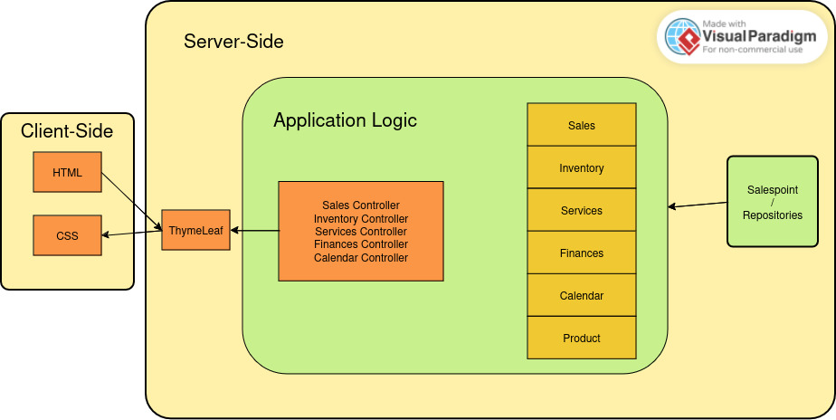

= Entwicklerdokumentation
:project_name: name-des-projekts
:toc: left
:numbered:

[options="header"]
[cols="1, 1, 3, 3"]
|===
|Version | Datum   | Autor | Beschreibung
|0.1	| 15.11 | Andrejs | Package Diagram + External Dependencies
|0.2	| 18.11 | Oleh | Start of package diagram for sales package
|0.3	| 18.11 | Andrejs | Vorgaben zum Betrieb der Software
|0.4	| 19.11 | Oleh | Kontextdiagramm
|0.5	| 19.11 | Davyd | Erfüllung der Qualitätsziele
|0.6	| 20.11 | Oleh | Sequenzdiagramm + Paketdiagramm
|0.7	| 20.11 | Davyd | ServiceSequenzdiagramm
|1.0	| 20.11 | Alle | Release
|===

== Einführung
Zuallererst braucht die Software eine Übersicht von dem Angebot des Großhändlers. Dabei
soll es möglich sein, Bestellungen aufzunehmen und sofort losschicken. Sobald
der Großhändler die Bestellung bestätigt hat, können die Angaben in den aktuellen
Bestand übernommen werden, da die Lieferung umgehend erfolgt. Zu
jeder Blumensorte stehen im Computer die aktuelle Anzahl sowie der Ein- und
Verkaufspreis. Außerdem wird die Rechnung des Großhändlers erfasst und der
Betrag sofort als Ausgabe für die tägliche Abrechnung verbucht.
Wenn ein Kunde in den Laden kommt und sich seinen Blumenstrauß ausgesucht
hat, muss in einem Rechnungsformular die Anzahl der dafür verwendeten
Pflanzen eintragen werden. Die Software berechnet den Verkaufspreis und der
Kunde kann entscheiden, ob er den Blumenstrauß in dieser Zusammenstellung
wirklich kaufen möchte. Wenn sich der Kunde entschieden hat, bekommt er
seine Rechnung, der Blumenbestand wird aktualisiert und der Betrag in der
Kasse wird angeglichen.

Ähnlich funktioniert es auch bei den Fertigsträußen, die Frau Floris herstellt,
wenn gerade keine Kunden im Laden sind. Abends stellt die Software die Einnahmen
und Ausgaben automatisch zusammen und gibt den aktuellen Kassenstand
aus.

Auch das Problem mit der Organisation für Hochzeiten soll die neue Software
lösen. Bereits während des Beratungsgespräches werden alle Angaben
eingegeben. Die endgültige Bestellung wird ausgelöst, wenn man sich über alle
Details einig geworden ist. Die benötigten Blumen erscheinen einen Tag vor
dem großen Ereignis automatisch in der Bestellung beim Großhändler und eine
Rechnung für Frau Meier wird erzeugt. Frau Floris kann diese als “bezahlt”
markieren, sobald das Geld (bar oder auf dem Konto) eingetroffen ist und somit
die Abrechnungen aktualisieren.

Der gemeinsam mit der Nichte geplante Pflanzenservice soll auch von der Software
unterstützt werden. Eine Firma, die eine Ausstattung ihrer Büro- und
Sitzungsräume mit Grünpflanzen wünscht, erteilt Frau Floris einen entsprechenden
Auftrag. Sie bestellt die benötigten Pflanzen beim Großhändler und arrangiert
sie in den Räumlichkeiten der Firma. Zusätzlich kann ein Servicevertrag
abgeschlossen werden, der die wöchentliche Pflege der Pflanzen durch Frau Floris
und auf Wunsch und zu anderen Konditionen auch die Versorgung mit frischen
Schnittblumen umfasst.

Nur die verwelkten Blumen in ihrem Laden kann die neue Software nicht aussortieren.
Diese müsste Frau Floris abends aber als Verlust in die Abrechnung
aufnehmen können.

*Also, am Ende soll ein internes Website fertig sein, das alle Geschäftsprozesse in dem Blumenladen von Frau Floris digitalisiert und in einigen Fällen auch automatisiert. Das wird zur einer starken Optimisierung von allen Bereichen der Geschäftsführung.*

== Randbedingungen
=== Hardware-Vorgaben

[cols="1, 1"]
|===
|Maus	| Benutzer
|Tastatur	| Benutzer
|Rechner mit Internetverbindung | Benutzer
|Server mit Linux	| Unternehmen
|===

=== Software-Vorgaben

The following (or newer) Java version is necessary to run the application:

[cols="1"]
|===
|Java 21
|===

The following (or newer) browser versions are necessary to use the application:
[cols="1, 1"]
|===
|Firefox |130.0.0
|Google Chrome |131.0.0
|Chromium based browsers |130.0.0
|Opera |114.0.0
|Safari |18.0
|===

=== Vorgaben zum Betrieb der Software
Das Program soll in dem Blumenladen intern (d.h. von den Mitarbeitern) bedient werden, um die Geschäftsprozesse (u.a. Verkauf, Einkauf, Bluemnpflegen-Dienstleistungen usw.) zu digitalisieren und vereinfachen.

Das Backend soll auf einem Server mindestens in Arbeitszeiten (oder länger) laufen und mittels des Netzwerkes zugänglich für Enduser-Rechener sein.

Die Nutzer sind Frau Floris (Besitzerin) und ihre Nichte (Mitarbeiterin im Service). Es wird vorausgesetzt, dass sie den Rechner im Wesentlichen bedienen können.

Das System soll keiner technischen Wartung bedürfen. Sämtliche Daten sollen persistent in einer Datenbank gespeichert und über die Anwendung zugänglich sein (z.B. sollten für Frau Floris keine SQL-Kenntnisse erforderlich sein).

== Kontextabgrenzung

[[context_diagram]]
image::./models/images/context_diagram_dd_a.svg[context diagram, 100%, 100%, pdfwidth=100%, title= "Kontextdiagramm für Blumenladen in C4", align=center]

== Lösungsstrategie
=== Erfüllung der Qualitätsziele
[options="header"]
|=== 
|Qualitätsziel |Lösungsansatz
|Verfügbarkeit a|
* Nutzen Sie einen globalen Fehlerbehandlungsmechanismus mit @ControllerAdvice in Spring, um alle möglichen Fehler abzufangen und benutzerfreundliche Fehlermeldungen zurückzugeben.
* Verhindern von Unterbrechungen der Geschäftsprozesse, um Umsatzverluste und Kundenunzufriedenheit zu vermeiden. Alle möglichen Fehler müssen abgefangen und richtig behandelt werden.
* Lagern Sie kritische statische Dateien wie Bilder, CSS und JS lokal auf dem Server, um die Abhängigkeit von externen Diensten zu reduzieren.
|Leistungsfähigkeit a|
* Vermeiden Sie redundante Logik in Controllern und Services. Jede Funktion sollte nur einmal in der entsprechenden Schicht implementiert sein, um den Overhead zu reduzieren.
* Entfernen Sie nicht benötigte Abhängigkeiten und Module aus der Spring-Konfiguration, um die Startzeit der Anwendung zu verkürzen und Ressourcen zu sparen.
* Reduzieren Sie den Overhead durch klare Trennung der Controller-Logik. Z. B. sollte ein Controller nur eine kleine Menge an Logik ausführen und ansonsten auf Services delegieren, um die Performance nicht zu beeinträchtigen.
|Benutzerfreundlichkeit a|
* Nutzen Sie Thymeleaf-Layouts (layout:decorator), um ein einheitliches Erscheinungsbild auf allen Seiten zu gewährleisten.
* Sie müssen sicherstellen, dass der Stil der Anwendung auf allen Seiten gleich ist, um den Lernaufwand zu minimieren.
* Der Benutzer sollte von jedem Punkt der Anwendung aus zu einem anderen Funktionsbereich wechseln können (z. B. von den Services zum Lagerbestand usw.).
* Schützen Sie den Benutzer vor Fehlern. Ungültige Eingaben dürfen nicht zu ungültigen Systemzuständen führen.
|Sicherheit a|
* Stellen Sie sicher, dass nur die Personen auf die Daten zugreifen können, die dazu berechtigt sind. Dies kann mit Spring Security und Thymeleaf (sec:authorize - Tag) realisiert werden.
* Verhindern Sie die unbefugte Änderung von Daten. Dies kann mit Spring Security (@PreAuthorize - Annotation) realisiert werden.
* Rückverfolgbarkeit von Aktionen oder Ereignissen zu einer eindeutigen Entität oder Person. Für diese Anwendung sollte jede Bestellung mit einem Kunden verknüpft sein.
|Wartbarkeit a|
* Entwickeln einer modularen Architektur, die mit minimalem Aufwand angepasst und erweitert werden kann.
* Dokumentieren des Codes sorgfältig, um eine kosteneffiziente langfristige Wartung zu ermöglichen.
* Sicherstellen, dass die Anwendung modifiziert oder erweitert werden kann, ohne dass Fehler auftreten oder die Produktqualität beeinträchtigt wird.
* Testabdeckung: Schreiben Sie Unit-Tests für kritische Logik mit JUnit.
|===

=== Softwarearchitektur

HTML-Templates werden auf dem Server gerendert von Controllers und im Client angezeigt, dabei werden sie mit CSS gestylt.
Thymeleaf übernimmt das Rendering und fügt dynamisch die Daten ein, die von den serverseitigen Controllern bereitgestellt werden.
Diese Controller – wie Sales, Inventory, Services, Finances und Calendar – rufen Daten über Modellklassen ab und verwalten sie.
Die Daten werden über Repository-Klassen gespeichert, die im Diagramm als *„Salespoint / Repositories“* gekennzeichnet sind.
Die Datenbank wird über JPA und Hibernate angesprochen, die die Daten in der Datenbank speichern und abrufen.

=== Entwurfsentscheidungen

==== Verwendete Muster
* Spring MVC

==== Persistenz
Die Anwendung verwendet *Hibernate Annotation Based Mapping*, um Java-Klassen Datenbanktabellen zuzuordnen. Als Datenbank wird *H2* verwendet.
Die Persistenz ist standardmäßig deaktiviert. Um den Persistenzspeicher zu aktivieren, müssen die folgenden beiden Zeilen in der Datei _application.properties_ auskommentiert werden:
....
# spring.datasource.url=jdbc:h2:./db/kickstart
# spring.jpa.hibernate.ddl-auto=update
....

==== Benutzeroberfläche

HINWEIS: Die grünen Kästchen zeigen eine HTML-Vorlage an. Die weißen Kästchen innerhalb der Vorlagen stellen Schaltflächen dar, die zu den Vorlagen weiterleiten, auf die ihre ausgehenden Pfeile zeigen._

=== Use of external frameworks

NOTE: Name the used external frameworks, in which packages you used them, and why you used them in your application. You only need to describe the high level artifact.

[options="header"]
|===
|Exterenes Framework|Kategorie|Beschreibung
|Spring Boot |General purpose |Vereinfacht die Entwicklung eigenständiger, produktionsreifer Anwendungen auf Basis von Spring.
|Spring Data JPA |Persistence |Verwaltet den Datenzugriff und die Datenpersistenz unter Verwendung der Java Persistence API (JPA).
|Spring Security |Security |Bietet Authentifizierung, Autorisierung und Schutz vor gängigen Sicherheitslücken.
|salespointframework |Backend | Zur Entwicklung von Point-of-Sales-Anwendungen (PoS) mit Spring Framework und Spring Boot. Es besteht aus einer Vielzahl von Geschäftsmodulen, die es dem Nutzer ermöglichen, darauf aufbauend anspruchsvolle Webanwendungen zu implementieren.
|Bootstrap | UI | Stellt Seiten-Layout-Tools und vordefinierte HTML-Elemente zu Verfügung.
|Apache PDFBox | Backend | Ermöglicht die Erstellung von PDF Dokumenten
|easytable | Backend | Vereinfacht die Erstellung von Tabellen in ApachePDFBox (https://github.com/vandeseer/easytable)
|===

NOTE: If you use JavaScript frameworks like Bootstrap, HTMX, etc. you have to add them to the list. The category is
mostly _UI_ and/or _Communication_.

[options="header", cols="1,2,3"]
|===
|Externes Package |Verwendet von |Warum
|salespointframework |Backend | Zur Entwicklung von Point-of-Sales-Anwendungen (PoS) mit Spring Framework und Spring Boot. Ermöglicht, darauf aufbauend anspruchsvolle Webanwendungen zu implementieren.
|Bootstrap | Frontend | Stellt Seiten-Layout-Tools und vordefinierte HTML-Elemente zu Verfügung.
|Thymeleaf | Frontend | Ermöglicht die dynamische Generierung von HTML mit serverseitigen Vorlagen für eine nahtlose Integration in Spring MVC.
|===

== Bausteinsicht
=== Package-Diagramm

[[package_diagram]]
image::./models/images/package_diagram_f.svg[package diagram, 100%, 100%, pdfwidth=100%, title= "Paketdiagramm in UML", align=center]

* Entwurfsklassendiagramme der einzelnen Packages

=== Product
[[class_diagram_product]]
image::./models/images/product_package_a.svg[class diagram, 100%, 100%, pdfwidth=100%, title= "Entwurfsklassendiagramm für product package in UML", align=center]

=== Sales
[[class_diagram_sales]]
image::./models/images/sales_package_c.svg[class diagram, 100%, 100%, pdfwidth=100%, title= "Entwurfsklassendiagramm für sales package in UML", align=center]

=== Calendar
[[class_diagram_calendar]]
image::./models/images/CalendarPackageDiagram.jpg[class diagram, 100%, 100%, pdfwidth=100%, title= "Entwurfsklassendiagramm für calendar package in UML", align=center]

=== Inventory
[[class_diagram_inventory]]
image::./models/images/InventoryPackage.svg[class diagram, 100%, 100%, pdfwidth=100%, title= "Entwurfsklassendiagramm für inventory package in UML", align=center]

=== Finances
[[class_diagram_finances]]
image::./models/images/Finances_uml_b.svg[class diagram, 100%, 100%, pdfwidth=100%, title= "Entwurfsklassendiagramm für finances package in UML", align=center]

=== Services
[[class_diagram_services]]

[options="header"]
|=== 
|Klasse/Enumeration |Description
|Flower | Ein Produkt: Blumen
|Bouquet | Ein Produkt: Bouquet
|Pricing | Klasse, die Verkaufs- und Kaufpreise darstellt
|ProductInventoryInitializer | Klasse, die eine Instanz von Produkten erstellen
|ProductService | Klasse, die die gesamte Back-End-Logik für eine Product darstellt
|SimpleOrder | Klasse, die Daten eines einfachen Kundenauftrags speichert
|SimpleOrderService | Klasse, die die gesamte Back-End-Logik für eine SimpleOrder darstellt
|SimpleOrderRepository | Klasse, die auf die Daten von SimpleOrder zugreift
|WholesalerOrder | Klasse, die Daten eines einfachen Kundenauftrags speichert
|WholesalerOrderRepository | Klasse, die die Daten einer Bestellung zum Kauf neuer Blumen beim Großhändler speichert
|WholsalerOrderService | Klasse, die die gesamte Back-End-Logik für eine WholesalerOrder darstellt
|BasketItem | Klasse, die für einen Artikel im Korb verantwortlich ist
|SalesController | Eine Klasse, die die Benutzeroberfläche über Dienste mit der Geschäftslogik verbindet und die angezeigten Daten von Sales Paket verwaltet
|BasketService | Klasse, die die gesamte Back-End-Logik für eine Basket darstellt
|SalesService | Klasse, die die gesamte Back-End-Logik für ein Sales Paket darstellt
|Event | Klasse, die die Details kapselt und ein echtes Veranstaltung abstrahiert
|CalendarDay | Klasse, die zusammen mit der Event-Klasse eine Aufzeichnung der Ereignisse eines bestimmten Datums enthält
|CalendarService | Klasse, die die gesamte Back-End-Logik für Calendar Paket darstellt
|CalendarController | Eine Klasse, die die Benutzeroberfläche über Dienste mit der Geschäftslogik verbindet und die angezeigten Daten von Calendar Paket verwaltet
|EventRepository | Klasse, die auf die Daten von Event zugreift
|InventoryController |Kommuniziert mit dem Frontend und geb bescheid welche Modal soll gesehen werden, und welche produkte
|ProductToDelete | Die Daten aller gelöschten Produkte
|FinancialReport | Klasse, die für den Finanzbericht verantwortlich ist
|DailyFinancialReport | Klasse, die für den täglichen Finanzbericht verantwortlich ist
|MonthlyFinancialReport | Klasse, die für den monatlichen Finanzbericht verantwortlich ist
|CashRegister | Klasse, die für alle Operationen mit Geld zuständig ist
|CashRegisterRepository | Klasse, die auf die Daten von CashRegister zugreift
|CashRegisterInitializer | Klasse, die eine Instanz von CashRegister erstellen
|CashRegisterService | Klasse, die die gesamte Back-End-Logik für eine CashRegister darstellt
|IntervalComparator | Klasse, die Intervalle vergleicht
|AcountancyEntryWrapper | Eine Klasse, die die Grundfunktionalität von AccountancyEntry um Kategorien, Zeitstempel und eine detaillierte Ansicht der Artikel und Mengen für verschiedene Auftragsarten erweitert
|Category | Enumeration, die für den Auftragstyp verantwortlich ist
|FinancesController | Eine Klasse, die die Benutzeroberfläche über Dienste mit der Geschäftslogik verbindet und die angezeigten Daten von Finances Paket verwaltet
|===

=== Rückverfolgbarkeit zwischen Analyse- und Entwurfsmodell
_Die folgende Tabelle zeigt die Rückverfolgbarkeit zwischen Entwurfs- und Analysemodell._

[options="header"]
|===
|Klasse/Enumeration (Analysemodell) |Klasse/Enumeration (Entwurfsmodell)
|Flower |flowershop.product.Flower
|Bouquet |flowershop.product.Bouquet
| Product | org.salespointframework.catalog.Product;
| Storage | flowershop.product.ProductCatalog
| FlowerShop | ...
| CashRegister | flowershop.finances.CashRegister
| OrderStatus | org.salespointframework.order.OrderStatus
| Order a|
						* org.salespointframework.order.Order
						* flowershop.services.AbstractOrder
            * flowershop.sales.SimpleOrder
| Invoice | ...
| PaymentMethod | String
| Contract | flowershop.services.ContractOrder
| Reservation | flowershop.services.ReservationOrder
| Client | flowershop.services.Client
| FinancialReport | flowershop.finances.FinancialReport
| DailyFinancialReport | flowershop.finances.DailyFinancialReport
| MonthlyFinancialReport | flowershop.finances.MonthlyFinancialReport
|===

== Laufzeitsicht
* Darstellung der Komponenteninteraktion anhand eines Sequenzdiagramms, welches die relevantesten Interaktionen darstellt.

=== Inventory
[[Inventory_Sequence_Diagram]]
image::./models/images/InventorySequenceDiagram.svg[class diagram, 100%, 100%, pdfwidth=100%, title= "Sequenzdiagramm für inventory packge in UML", align=center]

=== Calendar
[[sequence_diagram_calendar]]

=== Sales

[[sequence_diagram_sales]]
image::./models/images/sequence_diagram_sales_dd_a.svg[class diagram, 100%, 100%, pdfwidth=100%, title= "Sequenzdiagramm für sales packge", align=center]

=== Finances
[[sequence_diagram_finances]]
image::./models/images/finances_diagram.svg[Sequence Diagram, 100%, 100%, pdfwidth=100%, title= "Sequenzdiagramm der Finanzübersicht", align=center]

=== Services
[[sequence_diagram_services]]
image::./models/images/sequence_diagram_service.svg[Sequence Diagram, 100%, 100%, pdfwidth=100%, title= "Sequenzdiagramm der Serviceübersicht", align=center]
