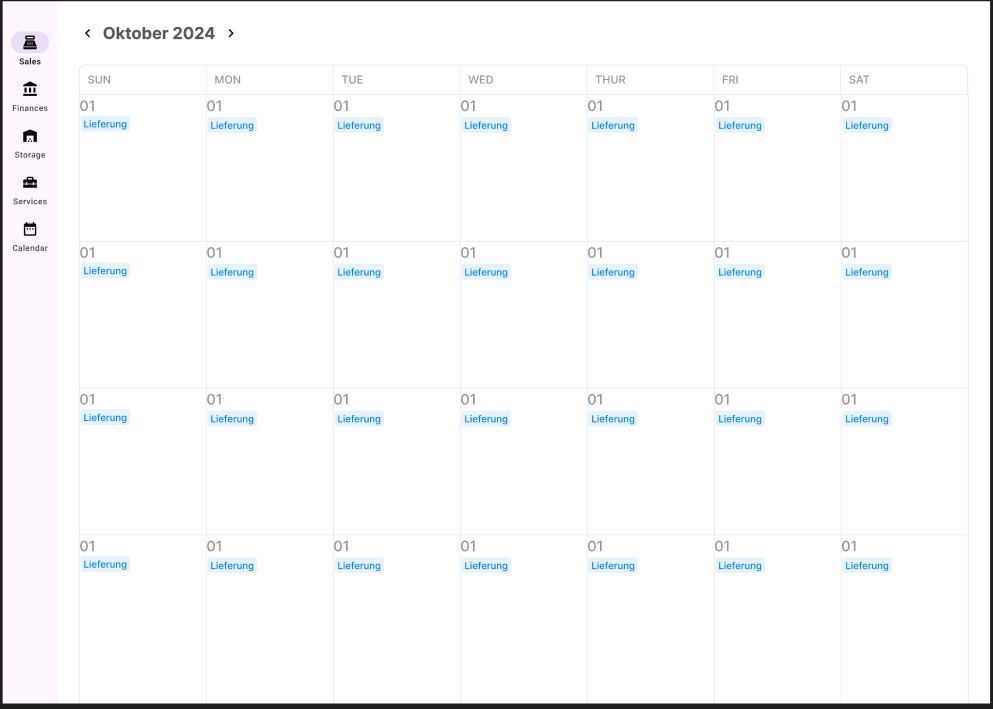

:project_name: Blumenladen
:toc: left
:numbered:
= Pflichtenheft __{project_name}__

[options="header"]
[cols="1, 1, 1, 1, 4"]
|===
|Version | Status      | Bearbeitungsdatum   | Autoren(en) |  Vermerk
|0.1     | In Arbeit   | 10.10.2021          | Autor       | Initiale Version
|0.1.1     | In Arbeit   | 21.10.2024          | Andrejs       | Akteure
|0.2     | In Arbeit   | 28.10.2024          | Andrejs       | Init UseCase & Class Diagrammen
|0.2.1     | In Arbeit   | 28.10.2024          | Andrejs       | UseCase & Class Diagrammen
|0.2.2     | In Arbeit   | 31.10.2024          | Davyd       | Funktionale und nicht-funktionale Anforderungen
|0.3      | In Arbeit   | 31.10.2024      | Bechir    |  Bearbeitung in Klassendiagram und beschreiben die Klassen und Enum
|0.3.1     | In Arbeit    | 31.10.2024     | Bechir    | schreiben der Zussammenfassung
|0.4     | In Arbeit    | 31.10.2024     | Oleh    | 4.Produktnutzung & 6.Systemgrenze und Top-Level-Architektur
|0.5     | In Arbeit    | 31.10.2024     | Andrejs    | Beschreibung von Anwendungsfällen
|0.6     | In Arbeit    | 01.11.2024     | Andrejs    | Stakeholders (Interessengrupppen)
|0.6.1     | In Arbeit    | 01.11.2024     | Andrejs    | Beschreibung von Anwendungsfällen in Adminmodul
|0.6.2     | In Arbeit    | 03.11.2024     | Andrejs    | Zusammenfassung erweitert
|0.6.3     | In Arbeit    | 03.11.2024     | Andrejs    | Cleanup
|0.6.4     | In Arbeit    | 03.11.2024     | Andrejs    | Cleanup
|1.0    | Fertig    | 03.11.2024     | Andrejs    | Release
|2.0    | Fertig    | 04.11.2024     | Alle    | Überarbeitung und Konsolidierung
|===

== Zusammenfassung

Das Pflichtenheft dient als zentrales Dokument zur detaillierten Beschreibung aller Anforderungen und Spezifikationen eines Projekts. Es regelt die verbindlichen Vorgaben, die für die Entwicklung, Umsetzung und Prüfung des Systems gelten, und stellt sicher, dass alle Projektbeteiligten ein gemeinsames Verständnis über den Umfang und die Ziele des Projekts haben.

Das System für das Blumenladen von Frau Rosa Floris digitalisiert und vereinfacht verschiedene Geschäftsprozesse:

**1. Finanzverwaltung:** Das System hilft Frau Floris dabei, Rechnungen zu verwalten, Tagesrechnungen und Monatsrechnungen zu erstellen sowie den Verlust durch verwelkte Blumen zu kalkulieren.

**2. Vertrieb und Verkauf:** Der Vertrieb umfasst den Einkauf von Blumen als Rohstoff, den Verkauf von Blumen oder Bouquets.

**3. Lagermanagement:** Mithilfe des Systems kann Frau Floris stets den Überblick über den aktuellen Warenbestand behalten.

**4. Serviceangebote:** Die Plattform unterstützt Dienstleistungen wie die Dekoration von Veranstaltungen, regelmäßige Blumenlieferungen sowie die Bereitstellung von Sträußen zur Abholung. Diese Services ermöglichen es Kunden, spezielle Angebote nach Wunsch zu nutzen.

**5. Admin-Bereich:** Ein Administrator verwaltet die Benutzerrechte und kann einen Großhandelskatalog simulieren, um die Auswahl zu erleichtern.

Für die Bezahlung steht den Kunden die Wahl zwischen Kartenzahlung und Barzahlung offen. Rechnungen lassen sich direkt nach dem Einkauf erstellen.

Dieses System digitalisiert die Abläufe und verbessert die Effizienz im gesamten Blumenladen.

== Aufgabenstellung und Zielsetzung
Zuallererst braucht die Software eine Übersicht von dem Angebot des Großhändlers. Dabei
soll es möglich sein, Bestellungen aufzunehmen und sofort losschicken. Sobald
der Großhändler die Bestellung bestätigt hat, können die Angaben in den aktuellen
Bestand übernommen werden, da die Lieferung umgehend erfolgt. Zu
jeder Blumensorte stehen im Computer die aktuelle Anzahl sowie der Ein- und
Verkaufspreis. Außerdem wird die Rechnung des Großhändlers erfasst und der
Betrag sofort als Ausgabe für die tägliche Abrechnung verbucht.
Wenn ein Kunde in den Laden kommt und sich seinen Blumenstrauß ausgesucht
hat, muss in einem Rechnungsformular die Anzahl der dafür verwendeten
Pflanzen eintragen werden. Die Software berechnet den Verkaufspreis und der
Kunde kann entscheiden, ob er den Blumenstrauß in dieser Zusammenstellung
wirklich kaufen möchte. Wenn sich der Kunde entschieden hat, bekommt er
seine Rechnung, der Blumenbestand wird aktualisiert und der Betrag in der
Kasse wird angeglichen.

Ähnlich funktioniert es auch bei den Fertigsträußen, die Frau Floris herstellt,
wenn gerade keine Kunden im Laden sind. Abends stellt die Software die Einnahmen
und Ausgaben automatisch zusammen und gibt den aktuellen Kassenstand
aus.

Auch das Problem mit der Organisation für Hochzeiten soll die neue Software
lösen. Bereits während des Beratungsgespräches werden alle Angaben
eingegeben. Die endgültige Bestellung wird ausgelöst, wenn man sich über alle
Details einig geworden ist. Die benötigten Blumen erscheinen einen Tag vor
dem großen Ereignis automatisch in der Bestellung beim Großhändler und eine
Rechnung für Frau Meier wird erzeugt. Frau Floris kann diese als “bezahlt”
markieren, sobald das Geld (bar oder auf dem Konto) eingetroffen ist und somit
die Abrechnungen aktualisieren.

Der gemeinsam mit der Nichte geplante Pflanzenservice soll auch von der Software
unterstützt werden. Eine Firma, die eine Ausstattung ihrer Büro- und
Sitzungsräume mit Grünpflanzen wünscht, erteilt Frau Floris einen entsprechenden
Auftrag. Sie bestellt die benötigten Pflanzen beim Großhändler und arrangiert
sie in den Räumlichkeiten der Firma. Zusätzlich kann ein Servicevertrag
abgeschlossen werden, der die wöchentliche Pflege der Pflanzen durch Frau Floris
und auf Wunsch und zu anderen Konditionen auch die Versorgung mit frischen
Schnittblumen umfasst.

Nur die verwelkten Blumen in ihrem Laden kann die neue Software nicht aussortieren.
Diese müsste Frau Floris abends aber als Verlust in die Abrechnung
aufnehmen können.

*Also, am Ende soll ein internes Website fertig sein, das alle Geschäftsprozesse in dem Blumenladen von Frau Floris digitalisiert und in einigen Fällen auch automatisiert. Das wird zur einer starken Optimisierung von allen Bereichen der Geschäftsführung.*

== Produktnutzung
Das System soll einer Frau Floris als Assistentin bei der Betreuung ihres Blumenladens dienen (z.B. Blumen und Sträuße an Kunden verkaufen, bei Großhaendler einkaufen, und andere Dienstleistungen anbieten). Die Software soll auf einem lokalen Server laufen und über den Webbrowser auf einem lokalen Rechner verfügbar sein.

Die primären Nutzer der Software sind Frau Floris und ihre Nichte, die nicht unbedingt einen technischen Hintergrund haben.

Das System soll keine technische Wartung benötigen. Alle Daten sollen dauerhaft in einer lokalen Datenbank gespeichert werden und über die Anwendung zugänglich sein (z.B. sollten für Frau Floris keine SQL-Kenntnisse erforderlich sein). Die Geldoperationen sollten auch mit Hilfe eines lokalen Geldmanagers durchgeführt werden können.

== Interessensgruppen (Stakeholders)

Diese Stakeholder beeinflussen die Anforderungen des Projekts, da ihre jeweiligen Bedürfnisse, Verantwortlichkeiten und gesetzlichen Anforderungen berücksichtigt werden müssen. Das System muss so konzipiert sein, dass es alle funktionalen, sicherheitsrelevanten Anforderungen erfüllt.

[options="header"]
[cols="1,4,4"]
|===
|Name |Interessen |Einfluss
|Frau Floris (Shop-Besitzerin) |Die Geschäftsinhaberin möchte den Verkauf von Blumen effizient gestalten und die Bestandsverwaltung sowie die finanzielle Berichterstattung optimieren. | Frau Floris wird wahrscheinlich die Hauptanforderungen an die Kernfunktionalitäten des Systems stellen.
|Kunden |Kunden erwarten einen einfachen und effizienten Einkaufsvorgang, z. B. eine schnelle Abwicklung an der Kasse und die Möglichkeit zur Abholung oder Lieferung von Blumen. |Anforderungen an die Benutzerfreundlichkeit und die Verfügbarkeit verschiedener Zahlungsmethoden sowie optionaler Services wie Abholung oder Lieferung.
|Mitarbeiterinnen und Mitarbeiter (z. B. Nichte im Service) |  Mitarbeiter, die in Service und Verkauf tätig sind, benötigen ein einfaches System für die Bearbeitung von Kundenaufträgen und die Durchführung von Bestandsupdates. | Anforderungen an die Benutzerfreundlichkeit und Funktionalität der Modulen, einschließlich Zugriff auf spezifische Berechtigungen.
|Großhändler |Großhändler sind für die Lieferung von Blumen als Rohstoffe zuständig und benötigen eine ordnungsgemäße Bestands- und Rechnungsverwaltung. | Anforderungen an die Schnittstellen für Bestellungen und Bestandsverwaltung sowie Berichte für die Großhändler.
|Administrator(en) | Der Administrator ist für die Zuweisung und Verwaltung von Berechtigungen verantwortlich, um sicherzustellen, dass Mitarbeiter nur auf die für ihre Rolle notwendigen Bereiche zugreifen können. | Anforderungen an das Berechtigungsmodul, das die Zugangskontrolle und Sicherheitsanforderungen gewährleistet.
| Softwareentwickler | Die technische Machbarkeit und Wartbarkeit des Systems, z. B. durch einen modularen Aufbau und eine klar strukturierte Softwarearchitektur. | Anforderungen an die technische Architektur, Skalierbarkeit, Wartbarkeit und Anpassbarkeit des Systems, einschließlich der Integration in vorhandene IT-Systeme.
|===

== Systemgrenze und Top-Level-Architektur

=== Kontextdiagramm
Das Kontextdiagramm zeigt das geplante Software-System in seiner Umgebung. Zur Umgebung gehören alle Nutzergruppen des Systems und Nachbarsysteme. Die Grafik kann auch informell gehalten sein.

[[context_diagram]]
image::./models/images/context_diagram_d.svg[context diagram, 100%, 100%, pdfwidth=100%, title= "Kontextdiagramm für {project_name} in UML", align=center]

=== Top-Level-Architektur
[[top_level_diagram]]
image::./models/images/top_level_diagram_d.svg[top level diagram, 100%, 100%, pdfwidth=100%, title= "Top-Level-Architektur für {project_name} in UML", align=center]

== Anwendungsfälle

=== Akteure

Akteure sind die Benutzer des Software-Systems oder Nachbarsysteme, welche darauf zugreifen. Diese Tabelle gibt einen Überblick über die Akteure und beschreibt sie kurz.

// See http://asciidoctor.org/docs/user-manual/#tables
[options="header"]
[cols="1,4"]
|===
|Name |Beschreibung
|Frau Rosa Floris  | Besitzerin - Verwaltung Finanzen und Lager. Berät Kunden bei Hochzeits- und Eventbestellungen.
|Rosas Nichte  | Leiterin Pflanzenservice - Bestellung für den Auftrag benötigten Pflanzen und Arrangierung der Räumlichkeiten vor Ort
|Kunden  | Kaufen Einzelblumen oder Blumensträuße. Einige Kunden bestellen spezielle Aufträge für Hochzeiten oder andere Veranstaltungen und erhalten Beratung.
|Administratoren | Verwalten das System, erteilen die Berechtigungen für Nutzer und sorgen für die reibungslose Funktion der Software.

|===

=== Überblick Anwendungsfalldiagramm

[[use_case_diagram]]
image::./models/images/use_cases_f.svg[use case diagram, 100%, 100%, pdfwidth=100%, title= "Anwendungsfalldiagramm für {project_name} in UML", align=center]

=== Anwendungsfallbeschreibungen
Dieser Unterabschnitt beschreibt die Anwendungsfälle. In dieser Beschreibung müssen noch nicht alle Sonderfälle und Varianten berücksichtigt werden. Schwerpunkt ist es, die wichtigsten Anwendungsfälle des Systems zu finden. Wichtig sind solche Anwendungsfälle, die für den Auftraggeber, den Nutzer den größten Nutzen bringen.
Komplexere Anwendungsfälle sind mit einem UML-Sequenzdiagramm ergänzt worden.

[cols="1h, 3"]
[[UC001]]
|===
|ID                         |**<<UC001>>**
|Name                       |Rechnungen ansehen, filtern
|Beschreibungen             | Frau Floris soll in der Lage sein, Rechnungen für den Blumenladen zu verwalten, um die Finanzen des Geschäfts zu überblicken. 
|Akteure                    | Frau Floris
|Auslöser                   | Frau Floris möchte die Finanzen überprüfen.
|Vorbedingungen            a| 	Frau Floris ist im System angemeldet und hat die entsprechenden Berechtigungen zur Rechnungsverwaltung.
|Wesentliche Schritte            a| 
1. Frau Floris wählt die Funktion „Rechnungen“ im Finanzmodul aus.
2. Sie kann eine bestehende Rechnung suchen, einsehen.
|Extensions                 | <<UC002>>, <<UC003>>
|Funktionale Anforderungen    |<<F0001>>
|===

[cols="1h, 3"]
[[UC002]]
|===
|ID                         |**<<UC002>>**
|Name                       | Tagesrechnung
|Beschreibungen             | Frau Floris soll in der Lage sein, die Tagesrechnung einzusehen, um die Finanzen des Geschäfts zu überblicken.
|Akteure                    | Frau Floris
|Auslöser                   | Am Tagesabschluss wird automatisch ausgelöst.
|Vorbedingungen            a| 	Frau Floris ist im System angemeldet und hat die entsprechenden Berechtigungen zur Rechnungsverwaltung.
|Wesentliche Schritte            a| 
1. Frau Floris wählt die Funktion „Rechnungen“ im Finanzmodul aus.
2. Sie kann eine bestehende Rechnung einsehen.
|Extensions                 |-
|Funktionale Anforderungen    |<<F0002>>
|===

[cols="1h, 3"]
[[UC003]]
|===
|ID                         |**<<UC003>>**
|Name                       | Monatsrechnung
|Beschreibungen             | Frau Floris soll in der Lage sein, die Monatsrechnung einzusehen, um die Finanzen des Geschäfts zu überblicken.  
|Akteure                    | Frau Floris
|Auslöser                   | Am Monatsabschluss wird automatisch ausgelöst.
|Vorbedingungen            a| 	Frau Floris ist im System angemeldet und hat die entsprechenden Berechtigungen zur Rechnungsverwaltung.
|Wesentliche Schritte            a| 
1. Frau Floris wählt die Funktion „Rechnungen“ im Finanzmodul aus.
2. Sie kann eine bestehende Rechnung einsehen.
|Extensions                 |-
|Funktionale Anforderungen    |<<F0003>>
|===

[cols="1h, 3"]
[[UC005]]
|===
|ID                         |**<<UC005>>**
|Name                       | Kassenstand sehen
|Beschreibungen             | Frau Floris soll Kontroll über Kasse haben.
|Akteure                    | Frau Floris
|Auslöser                   | Frau Floris will den Kassenstand prüfen. 
|Vorbedingungen            a| 	Frau Floris ist im System angemeldet und hat die entsprechenden Berechtigungen.
|Wesentliche Schritte            a| 
1. Frau Floris wählt die Funktion „Kasse“ im Finanzmodul aus.
2. Sie sieht die Bilanz und letzte Transaktionen.
|Extensions                 |-
|Funktionale Anforderungen    |<<F0004>>, <<F0102>>
|===

[cols="1h, 3"]
[[UC006]]
|===
|ID                         |**<<UC006>>**
|Name                       | Rechnungen als PDF exportieren 
|Beschreibungen             | Alle Rechnungen sollen in PDF-Format konvertierbar sein.
|Akteure                    | Frau Floris
|Auslöser                   | Frau Floris will eine Rechnung herunterladen.
|Vorbedingungen            a| 	Frau Floris ist im System angemeldet und hat die entsprechenden Berechtigungen.
|Wesentliche Schritte            a| 
1. Frau Floris wählt die Funktion „Rechnungen“ im Finanzmodul aus.
2. Sie wählt eine Rechnung aus und kann sie durch den Button "Als PDF exportieren" herunterladen.
|Extensions                 |-
|Funktionale Anforderungen    | <<F0006>>
|===

[cols="1h, 3"]
[[UC301]]
|===
|ID                         |**<<UC301>>**
|Name                       | Blumen als Rohstoff einkaufen
|Beschreibungen             | Frau Floris soll Blumen von Großhändler einkaufen können. Dabei muss auch Lagerbestand mit neugekauften Blumen aktualisiert werden.
|Akteure                    | Frau Floris, Großhändler
|Auslöser                   | Es fehlt an Blumen im Lager.
|Vorbedingungen            a| 	Frau Floris ist im System angemeldet und hat die entsprechenden Berechtigungen zum Vertrieb.
|Wesentliche Schritte            a| 
1. Frau Floris wählt die Funktion „Großhändler“ im Lagermodul aus.
2. Sie wählt Blumen aus Katalog aus und bestätigt den Kauf.
3. Der Großhändler bestätigt den Vorgang. 
|Extensions                 |-
|Funktionale Anforderungen    |<<F0101>>, <<F0102>>
|===

[[sequence_diagram_101]]
image::./models/images/sequence_diagram_101_g.svg[sequence diagram, 100%, 100%, pdfwidth=100%, title= "Sequenzdiagramm für Anwendungsfall 301 für {project_name} in UML", align=center]

[cols="1h, 3"]
[[UC302]]
|===
|ID                         |**<<UC302>>**
|Name                       | Blumen im Lager filtern, suchen
|Beschreibungen             | Frau Floris soll Blumen im Lager übersichten können. 
|Akteure                    | Frau Floris
|Auslöser                   | Frau Floris will eine Lagerübersicht bekommen.
|Vorbedingungen            a| 	Frau Floris ist im System angemeldet und hat die entsprechenden Berechtigungen zum Lager.
|Wesentliche Schritte            a| 
1. Frau Floris wählt Lagermodul aus.
2. Sie kann alle Blumen bzw. Blumensträußen sehen.
3. Sie kann die Produkte filtern durch ein Suchfeld.
|Extensions                 |-
|Funktionale Anforderungen    |<<F0101>>, <<F0102>>
|===

[cols="1h, 3"]
[[UC101]]
|===
|ID                         |**<<UC101>>**
|Name                       | Verkauf von Blumen bzw. Sträußen im Laden
|Beschreibungen             | Frau Floris soll Produkte an der Kasse verkaufen können. Dabei muss auch Lagerbestand aktualisiert werden.
|Akteure                    | Frau Floris, Kunde
|Auslöser                   | Der Kunde ist ins Laden gekommen, hat gewünschte Produkte ausgewählt und zur Kasse gegagngen. 
|Vorbedingungen            a| 	Frau Floris ist im System angemeldet und hat die entsprechenden Berechtigungen zum Vertrieb.
|Wesentliche Schritte            a| 
1. Frau Floris wählt die Funktion „Verkauf“ im Vertribsmodul aus.
2. Sie wählt Blumen bzw. Sträuße aus Katalog aus und bestätigt den Kauf.
3. Der Kunde bezahlt oder storniert. 
|Extensions                 |-
|Funktionale Anforderungen    |<<F0103>>, <<F0301>>, <<F0105>>
|===

[cols="1h, 3"]
[[UC102]]
|===
|ID                         |**<<UC102>>**
|Name                       | Fertigstrauß erstellen
|Beschreibungen             | Frau Floris soll Fertigsträuße erstellen können. Dabei muss auch Lagerbestand aktualisiert werden, indem die Blumen zu einem Strauß zuweisen.
|Akteure                    | Frau Floris
|Auslöser                   | Es sind keine Kunde im Laden und Frau Floris hat entschieden, einen Blumenstrauß zu machen. 
|Vorbedingungen            a| 	Frau Floris ist im System angemeldet und hat die entsprechenden Berechtigungen zum Vertrieb.
|Wesentliche Schritte            a| 
1. Frau Floris druckt den Button "Fertigstrauß erstellen". 
2. Sie wählt Blumen aus Katalog aus und bestätigt den Vorgang.
|Extensions                 |-
|Funktionale Anforderungen    |<<F0104>>, <<F0301>>
|===

[cols="1h, 3"]
[[UC201]]
|===
|ID                         |**<<UC201>>**
|Name                       | Eine Veranstaltung mit Blumen ausstatten
|Beschreibungen             | Ein Kunde soll die Möglichkeit haben, eine Veranstaltung mit Blumen ausstatten zu lassen, indem er den Service des Blumenshops bucht. Die Nichte organisiert die Lieferung und arrangiert die Blumen vor Or
|Akteure                    | Frau Floris, Nichte, Kunde
|Auslöser                   | Ein Kunde bestellt Blumenservice für eine Veranstaltung per Telefon. 
|Vorbedingungen            a| 	Blumen und Materialien für die Veranstaltung sind auf Lager und der Kunde hat eine Veranstaltung gebucht.
|Wesentliche Schritte            a| 
1. Kunde kontaktiert den Blumenshop (Frau Rosa) und bucht den Blumenservice für eine Veranstaltung.
2. Nichte überprüft die benötigten Blumen und Materialien im Lagerbestand.
3. Nichte plant die Lieferung und arrangiert die Blumen vor Ort für die Veranstaltung.
|Extensions                 |-
|Funktionale Anforderungen    | <<F0201>>
|===

[cols="1h, 3"]
[[UC202]]
|===
|ID                         |**<<UC202>>**
|Name                       | Ein- bzw. mehrmaliges Blumenservice
|Beschreibungen             | Ein Kunde soll die Möglichkeit haben, einen einmaligen oder wiederkehrenden Blumenservice für verschiedene Anlässe (z. B. Hochzeiten, Firmenveranstaltungen) zu buchen. Die Nichte organisiert die Lieferung und stellt sicher, dass die Blumen regelmäßig oder wie gewünscht vor Ort arrangiert werden. 
|Akteure                    | Frau Floris, Nichte, Kunde
|Auslöser                   | Ein Kunde bestellt Blumenservice für eine Veranstaltung per Telefon. 
|Vorbedingungen            a| 	Kunde möchte einen einmaligen oder regelmäßigen Blumenservice buchen.
|Wesentliche Schritte            a| 
1. Kunde kontaktiert den Blumenshop und wählt zwischen einem einmaligen und einem mehrmaligen Blumenservice.
2. Kunde legt den gewünschten Zeitraum und die Häufigkeit der Lieferungen fest.
3. Nichte überprüft die Lagerbestände und stellt die erforderlichen Blumen und Materialien zusammen.
4. Nichte organisiert die Lieferung und arrangiert bzw. pflegt die Blumen entweder einmalig oder regelmäßig nach den Vorgaben des Kunden vor Ort.
|Extensions                 | -
|Funktionale Anforderungen    | <<F0202>>
|===

[[sequence_diagram_302]]
image::./models/images/sequence_diagram_302_c.svg[sequence diagram, 100%, 100%, pdfwidth=100%, title= "Sequenzdiagramm für Anwendungsfall 202 für {project_name} in UML", align=center]

[cols="1h, 3"]
[[UC203]]
|===
|ID                         |**<<UC203>>**
|Name                       | Blumen zur Abholung im Laden
|Beschreibungen             | Ein Kunde soll die Möglichkeit haben, eine "Rerservierung" oder Kauf zur Abholung im Laden betätigen.
|Akteure                    | Frau Floris, Nichte, Kunde
|Auslöser                   | Ein Kunde bestellt Blumenservice für eine Veranstaltung per Telefon. 
|Vorbedingungen            a| 	Die gewünschten Blumen sind im Lager verfügbar oder wurden rechtzeitig bestellt und vorbereitet.
|Wesentliche Schritte            a| 
1. Kunde kontaktiert den Blumenshop und gibt Frau Floris an, dass er Blumen zur Abholung im Laden wünscht.
2. Kunde wählt zwischen einer einmaligen Abholung und einem regelmäßigen Abholservice.
3. Nichte prüft die Verfügbarkeit der Blumen im Lager und reserviert die benötigten Blumen für die Abholung.
4. Nichte informiert den Kunden über den Abholzeitpunkt und stellt die Blumen im Laden zur Verfügung.
5. Kunde holt die Blumen zum vereinbarten Zeitpunkt im Laden ab.
|Extensions                 |-
|Funktionale Anforderungen    | <<F0203>>
|===

[[Sequencediagramm_203]]
image::./models/images/sequence_diagram_UC303.svg[sequence diagram, 100%, 100%, pdfwidth=100%, title= "Sequenzdiagramm für Anwendungsfall 203 für {project_name} in UML", align=center]

[cols="1h, 3"]
[[UC401]]
|===
|ID                         |**<<UC401>>**
|Name                       | Kalender navigieren
|Beschreibungen             | Ein Mitarbeiter soll die Möglichkeit haben, Kalender zu navigieren.
|Akteure                    | Frau Floris, Nichte
|Auslöser                   | Frau Floris oder die Nichte will den Kalender anschauen.
|Vorbedingungen            a| Man hat die entsprechende Berechtigung. 
|Wesentliche Schritte            a| 
1. Ein Mitarbeiter wählt Kalendermodul aus.
2. Der Mitarbeiter kann den Kalender navigeren, indem er die Daten ändern und Termine sehen kann. 
|Extensions                 |-
|Funktionale Anforderungen    | <<F0401>>
|===

[cols="1h, 3"]
[[UC402]]
|===
|ID                         |**<<UC402>>**
|Name                       | Services im Kalender
|Beschreibungen             | Sämtliche Dienstsleistungen des Ladens sollen in den Kalender automatisch eingetragen werden. 
|Akteure                    | Frau Floris, Nichte
|Auslöser                   | Frau Floris oder die Nichte legt eine neue Dienstleistung (Service) an.
|Vorbedingungen            a| Man hat die entsprechende Berechtigung. 
|Wesentliche Schritte            a| 
1. Ein Mitarbeiter wählt Kalendermodul aus.
2. Der Mitarbeiter kann im Kalender den korrekten Servicetermin sehen.   
|Extensions                 |-
|Funktionale Anforderungen    | <<F0402>> 
|===

[cols="1h, 3"]
[[UC403]]
|===
|ID                         |**<<UC403>>**
|Name                       | Sonstige Termine im Kalender
|Beschreibungen             | Ein Mitarbeiter soll die Möglichkeit haben, im Kalender einen beliebigen (auch nicht Businessbezogenenen) Termin anlegen. 
|Akteure                    | Frau Floris, Nichte
|Auslöser                   | Frau Floris oder die Nichte legt einen neuen Termin an.
|Vorbedingungen            a| Man hat die entsprechende Berechtigung. 
|Wesentliche Schritte            a| 
1. Ein Mitarbeiter wählt Kalendermodul aus.
2. Der Mitarbeiter wählt die Funktion "Neuer Termin" aus.
3. Der Mitarbeiter trägt benötigte Daten zur Terminerstellung ein. 
3. Der kann den neuen Termin im Kalender sehen. 
|Extensions                 |-
|Funktionale Anforderungen    | <<F0403>> 
|===

== Funktionale Anforderungen

Dieser Abschnitt gibt einen Überblick über die funktionalen Anforderungen des Systems.

Die Tabellen enthalten:

 - Eine eindeutige Kennung der Anforderung (ID), die für die Referenzierung während des gesamten Projekts verwendet werden kann
 - Die aktuelle Version der Anforderung, da Änderungen an einer Anforderung während des Projekts auftreten können
 - einen Kurznamen für die Anforderung
 - Die Beschreibung der Anforderung

Die Anforderungen werden in Muss-Kriterien und Kann-Kriterien unterteilt:

=== Muss-Kriterien
Was das zu erstellende Programm auf alle Fälle leisten muss.

[options="header", cols="2h,1,3,12"]
|===

| ID | Version | Name | Beschreibung

| [[F0001]]<<F0001>> 
| v0.1 
| Rechnungen ansehen, filtern 
| Das System soll es ermöglichen, Rechnungen anzusehen und zu filtern, einschließlich Ein- und Ausgabenübersicht, um Transaktionen effizient zu verwalten.

| [[F0002]]<<F0002>>
| v0.1
| Tagesabrechnung
| Das System soll am Ende des Tages die Einnahmen und Ausgaben automatisch zusammenstellen und den aktuellen Kassenstand anzeigen.

| [[F0003]]<<F0003>>
| v0.1
| Monatsabrechnung
| Das System soll eine monatliche Abrechnung der Einnahmen und Ausgaben erstellen, um einen detaillierten Überblick über die finanzielle Lage des Geschäfts zu bieten.

| [[F0004]]<<F0004>> 
| v0.1 
| Verwelkte Blumen als Verlust berechnen
| Das System soll es ermöglichen, abends verwelkte Blumen als Verlust in die Abrechnung aufzunehmen und sie automatisch in den Finanzberichten auszuweisen, um sie als Teil der Finanzen zu berücksichtigen.

| [[F0005]]<<F0005>> 
| v0.1 
| Kassenstand sehen 
| Das System soll es ermöglichen, den aktuellen Kassenstand einzusehen und zu aktualisieren, um die Finanzdaten stets auf dem neuesten Stand zu halten.

| [[F0006]]<<F0006>> 
| v0.1 
| Rechnungen als PDF exportieren 
| Das System soll Rechnungen als PDF exportieren und herunterladen können, um eine einfache Speicherung und Weitergabe zu ermöglichen.

| [[F0101]]<<F0101>>
| v0.1
| Blumen als Rohstoff einkaufen 
| Das System soll es ermöglichen, Blumen als Rohstoff bei Großhändlern einzukaufen, um den Lagerbestand aufzufüllen.

| [[F0103]]<<F0103>>
| v0.1
| Verkauf von Blumen bzw. Sträußen im Laden 
| Das System soll den Verkauf von Blumen und Sträußen im Geschäft unterstützen, indem es nach dem Kauf eine Rechnung ausstellt, auf deren Grundlage der Kunde entscheidet, ob er einen Kauf tätigen möchte oder nicht.

| [[F0104]]<<F0104>>
| v0.1
| Fertigsträuße erstellen
| Das System soll es ermöglichen, dass man Fertigsträuße erstellt und deren Bestand im System verwaltet.

| [[F0105]]<<F0105>> 
| v0.1 
| Warenkorb 
| Das System sollte eine Warenkorbfunktion bieten, um die Bestellung und ihre Details zu verwalten. Der Warenkorb soll die Anzahl der zu verkaufenden Artikel und den zu zahlenden Betrag an zeigen.

| [[F0201]]<<F0201>>
| v0.1
| Eine Veranstaltung mit Blumen ausstatten 
| Das System soll die Planung und Ausstattung von Veranstaltungen mit Blumen ermöglichen, einschließlich der Mengenangabe der Blumen, der Möglichkeit zum Hinzufügen und Entfernen von Blumen.

| [[F0202]]<<F0202>>
| v0.1
| Mehr- bzw. einmaliges Blumenservice 
| Das System soll die Bereitstellung eines einmaligen oder wiederkehrenden Blumenservices für Kunden organisieren, einschließlich Lieferung und Pflege nach Bedarf, sowie einer detaillierten Übersicht im Kalender.

| [[F0203]]<<F0203>>
| v0.1
| Blumen zur Abholung im Laden 
| Das System soll es Kunden ermöglichen, Blumen zur Abholung im Laden zu bestellen. Es soll verschiedene Bestellstatus anzeigen, wie z.B. "In Bearbeitung", "Bereit zur Abholung" und "Abgeholt". Diese Status sollen im System sichtbar sein, damit das Personal den Fortschritt der Bestellung verfolgen können.

| [[F0204]]<<F0204>> 
| v0.1 
| Bestellansicht 
| Das System soll eine detaillierte Ansicht für Bestellungen bieten, um alle relevanten Informationen schnell einsehen zu können.

| [[F0301]]<<F0301>> 
| v0.1 
| Lagerstand für Blumen erhöhen bzw. reduzieren 
| Das System soll den Lagerstand für Blumen erhöhen oder reduzieren können, basierend auf dem Ein- und Verkauf von Blumen.

| [[F0302]]<<F0302>>
| v0.1 
| Blumen im Lager filtern und suchen 
| Das System soll eine Filter- und Suchfunktion für Blumen im Lagerbestand bereitstellen, um eine schnelle und gezielte Lagerverwaltung zu ermöglichen.

| [[F0401]]<<F0401>>
| v0.1 
| Kalender navigieren 
| Das System soll eine Funktion zum Navigieren im Kalender bieten, damit man einen Überblick über alle bevorstehenden Termine und Services erhält.

| [[F0402]]<<F0402>> 
| v0.1 
| Services im Kalender anzeigen 
| Das System soll allgemeine Übersichten zu Services, wie Blumenausstattungen für Veranstaltungen oder Mehr- bzw. einmaliges Blumenservice, im Kalender anzeigen, um die Terminverwaltung zu unterstützen.

| [[F0403]]<<F0403>> 
| v0.1 
| Sonstige Termine im Kalender verwalten 
| Das System soll die Möglichkeit bieten, verschiedene (nicht nur Blumenausstattungen für Veranstaltungen oder Mehr- bzw. einmaliges Blumenservice) Termine im Kalender zu verwalten, um die Organisation zu erleichtern.

| [[F0501]]<<F0501>> 
| v0.1 
| Zugriffskontrolle und Berechtigungen 
| Das System soll Login- und Logout-Funktionen sowie die Verwaltung der Zugriffsrechte für verschiedene Benutzerrollen bieten, um die Sicherheit zu gewährleisten.

|===

=== Kann-Kriterien
Anforderungen die das Programm leisten können soll, aber für den korrekten Betrieb entbehrlich sind.

== Nicht-Funktionale Anforderungen

Dieser Abschnitt gibt einen Überblick über die nicht-funktionalen Anforderungen des Projekts Blumenladen.
Diese Anforderungen beschreiben, wie das System funktionieren soll und in welchen Grenzen es arbeiten soll.

=== Qualitätsziele

Die folgende Tabelle zeigt die Qualitätsanforderungen, die in welchem Umfang erfüllt werden müssen.
Die erste Spalte listet die Qualitätsanforderungen auf, während in den folgenden Spalten die Priorität mit einem "x" markiert ist.
Die zugewiesene Priorität muss bei der Formulierung der konkreten nicht-funktionalen Anforderungen berücksichtigt werden.

1 = Weniger wichtig ..
5 = Sehr wichtig
[options="header", cols="3h, ^1, ^1, ^1, ^1, ^1"]
|===
|Qualitätsanforderung       | 1 | 2 | 3 | 4 | 5
|Verfügbarkeit               |   |   |   | x |
|Leistungsfähigkeit          |   |   | x |   |
|Benutzerfreundlichkeit      |   |   |   | x |
|Sicherheit                  |   |   | x |   | 
|Wartbarkeit                 |   |   | x |   |
|===

Verfügbarkeit (Priorität 4)
Verfügbarkeit ist für den kontinuierlichen Betrieb des Systems im Blumenladen essenziell. Da Mitarbeiter und Kunden zu jeder Zeit auf das System zugreifen, um Bestellungen, Rechnungen und Lagerbestände zu verwalten, muss das System zuverlässig verfügbar sein. Diese Anforderung wurde als wichtig eingestuft, um sicherzustellen, dass das System keine Ausfälle hat, die den Geschäftsprozess unterbrechen könnten. Eine hohe Verfügbarkeit minimiert das Risiko von Umsatzverlusten und steigert die Kundenzufriedenheit.

Leistungsfähigkeit (Priorität 3)
Das System muss in der Lage sein, mehrere Prozesse effizient abzuwickeln, insbesondere zu Spitzenzeiten (wenn es viele Termine an einem Tag gibt oder viele Bestellungen, Reservierungen). Die Leistungspriorität wurde aufgrund der geringen Anforderungen des Arbeitsumfelds in einem Blumenladen als mittel eingestuft, es handelt sich nicht um ein ganzes Franchise oder ein riesiges Unternehmen, dennoch muss das System in der Lage sein, die Anforderungen des täglichen Betriebs zu bewältigen und die Leistung auch bei erhöhter Belastung nicht zu beeinträchtigen. Dies gewährleistet eine schnelle und reibungslose Auftragsabwicklung und Lagerprozesse.

Benutzerfreundlichkeit (Priorität 4)
Die Benutzerfreundlichkeit ist für die Mitarbeiter des Blumenladens sehr wichtig, da sie möglicherweise keine technischen Kenntnisse haben. Das benutzerfreundliche System ist intuitiv bedienbar und ermöglicht es den Benutzern, ihre Aufgaben schnell und effizient zu erledigen. Diese Anforderung wurde als sehr wichtig erachtet, um den Schulungsaufwand für das Personal zu minimieren und die Arbeitsabläufe im Geschäft zu optimieren.

Sicherheit (Priorität 3)
Da das System sensible Daten wie Kundeninformationen und Finanzdaten verarbeitet, muss es ausreichende Sicherheitsmaßnahmen bieten. Die Sicherheit wurde mit mittlerer Priorität bewertet, da ein Grundschutz gegen unbefugten Zugriff und Datenverluste erforderlich ist. Obwohl das Blumenladen-System keine extrem kritischen Daten verwaltet, ist ein gewisses Maß an Sicherheit notwendig, um den Datenschutz zu gewährleisten und die Datenintegrität zu wahren.

Wartbarkeit (Priorität 3)
Wartbarkeit stellt sicher, dass das System mit minimalem Aufwand angepasst und erweitert werden kann, um den sich ändernden Anforderungen des Geschäfts gerecht zu werden. Diese Anforderung wurde als mittel priorisiert, um zu gewährleisten, dass das System langfristig kosteneffizient betrieben und flexibel erweitert werden kann. Wartbarkeit ist besonders wichtig für zukünftige Anpassungen und regelmäßige Aktualisierungen, damit das System stets den aktuellen Bedürfnissen des Ladens entspricht.

=== Konkrete Nicht-Funktionale Anforderungen

[options="header", cols="2h, 1, 3, 12"]
|===
|ID
|Version
|Name
|Beschreibung

|[[NF0010]]<<NF0010>>
|v0.1
|Verfügbarkeit - Betriebszeit
a|
Das System soll eine hohe Betriebszeit gewährleisten, um sicherzustellen, dass die Anwendung für Benutzer zuverlässig verfügbar ist und Ausfallzeiten minimiert werden.

|[[NF0020]]<<NF0020>>
|v0.1
|Sicherheit - Passwortspeicherung
a|
Passwörter der Benutzer sollen nur als Hash-Werte gespeichert werden, um Diebstahl und Missbrauch zu verhindern.

|[[NF0030]]<<NF0030>>
|v0.1
|Leistungsfähigkeit - Reaktionszeit der Benutzeroberfläche
a|
Die Reaktionszeit der Benutzeroberfläche soll nicht mehr als 2 Sekunden für jede Hauptfunktionalität betragen, wie das Abrufen des Lagerbestands, das Erstellen von Rechnungen und das Verwalten von Bestellungen.

|[[NF0040]]<<NF0040>>
|v0.1
|Benutzerfreundlichkeit - Intuitive Bedienung
a|
Die Benutzeroberfläche des Systems soll so gestaltet sein, dass Mitarbeiter ohne technische Vorkenntnisse in der Lage sind, die wichtigsten Funktionen wie Rechnungsstellung, Bestandsverwaltung und Bestellungserstellung innerhalb von maximal 1 Stunde Einarbeitungszeit zu beherrschen.

|[[NF0050]]<<NF0050>>
|v0.1
|Wartbarkeit - Dokumentation und Code-Kommentare
a|
Der Quellcode des Systems soll ausführlich dokumentiert sein, um spätere Wartung und Erweiterungen zu erleichtern. Jede wichtige Funktion soll mindestens einen erklärenden Kommentar enthalten, und es soll eine klare Struktur für zukünftige Entwickler vorgegeben sein.

|===

== GUI Prototyp

[[Sales]]

[[Services]]

[[Inventory]]

[[Rechnung]]
image::./models/images/Rechnung.png[Rechnungpage, title= "Die Rechnung der Laden", 100%, 100%, pdfwidth=100%, align=center]

[[Kalender]]

Konkrete Absprachen - beispielsweise ob der grafische Prototyp oder die Dialoglandkarte höhere Priorität hat - sind mit dem Kunden zu treffen.

== Überblick: Dialoglandkarte
//Die nachfolgende Abbildung zeigt eine an die Pinnwand gezeichnete Dialoglandkarte. Ihre Karte sollte zusätzlich die Buttons/Funktionen darstellen, mit deren Hilfe Sie zwischen den Masken navigieren.
[[DialogLandkarte]]

=== Dialogbeschreibung

. Navigation zwischen den Seiten
. Order bestellen, nach Auswahl der Artikel
. Seachbar für die Artikel
. Filtern nach Kategorien
. Blumenstrauß mit ausgewählten Blumen erstellen
. Zum Korb hinzufügen
. Tagesrechung herunterladen
. Monatsrechung herunterladen
. Datumsauswahl
. Neue Service erstellen
. Service schließen

== Datenmodell

=== Überblick: Klassendiagramm
UML-Analyseklassendiagramm

[[analysis_class_diagram]]
image::./models/images/analysis_class_c.svg[Analysenklassendiagramm, 100%, 100%, pdfwidth=100%, title= "Analysenklassendiagramm für {project_name} in UML", align=center]

=== Klassen und Enumerationen
Dieser Abschnitt stellt eine Vereinigung von Glossar und der Beschreibung von Klassen/Enumerationen dar. Jede Klasse und Enumeration wird in Form eines Glossars textuell beschrieben. Zusätzlich werden eventuellen Konsistenz- und Formatierungsregeln aufgeführt.

// See http://asciidoctor.org/docs/user-manual/#tables
[options="header"]
|===
|Klasse/Enumeration |Beschreibung 
|1. Client|Enthält Informationen über den Kunden, wie Name, Adresse und Telefonnummer. ein Client Objekt kann in Reservation oder Contract als Attribut vorliegt.
|2. Contract|Erbt von der Klasse Ordner und enthält ein oder mehr Client-Objekt sowie ein Date-Range-Attribut. Das Attribut frequence beschreibt, wie oft eine Lieferung erfolgen soll. 
|3. Reservation| erbt von der Klasse Ordner und enthält ein oder mehr Client-Objekt und Date-Time-Attribut, was die Datum von der Reservierung beschreibt.
|4.Invoice |Jedes Invoice-Objekt hat eine einzigartige ID und eine PaymentMethod.
|5.Product  |Jedes Product hat einen Namen, Einkaufspreis, Verkaufspreis und eine einzigartige ID. 
|6.Flower | Erbt von Product und hat ein zusätzliches Attribut für die Farbe. 
|7.Bouquet |Erbt von Product und besitzt ein Attribut additionalPrice. Jedes Bouquet kann aus zwei oder mehr Blumen bestehen. 
|8.Storage |Ein Storage enthält mehrere Produkte. 
|9.CashRegister |Ein CashRegister kann mehrere FinancialReport-Objekte enthalten. 
|10.FinancialReport |Jedes FinancialReport-Objekt enthält Informationen über die Finanzen, wie Einnahmen und Ausgaben, den aktuellen Stand (Balance) und eine Zahl für den Profit. Die Daten werden aus dem CashRegister genutzt. 
|11.DailyFinancialReport |Erbt von FinancialReport und behandelt täglich die Attribute. 
|12.MonthlyFinancialReport |Erbt von FinancialReport und verarbeitet die Attribute monatlich. 
|13.OrderStatus  |Eine Enumeration, die nur zwei Werte enthält: PAID und NOT_PAID. 
|14.Order  |Eine Bestellung kann ein oder mehrere Produkte, eine ID, eine Variable vom Typ OrderStatus und eine Invoice enthalten. 
|15.FlowerShop |Verfügt über ein Management für das Storage, bietet eine Übersicht über alle Bestellungen, hat eine unbegrenzte Anzahl an RegisteredUsers und ein CashRegister. 
|16. PaymentMethod  |Enthält zwei Attribute – Card, damit der Kunde mit Karte zahlen kann, und Cash, damit der Kunde bar bezahlen kann. 
|===

== Akzeptanztestfälle
Mithilfe von Akzeptanztests wird geprüft, ob die Software die funktionalen Erwartungen und Anforderungen im Gebrauch
erfüllt.
Diese sollen und können aus den Anwendungsfallbeschreibungen und den UML-Sequenzdiagrammen abgeleitet werden.
D.h., pro (komplexen) Anwendungsfall gibt es typischerweise mindestens ein Sequenzdiagramm (, welches ein
Szenarium beschreibt). Für jedes Szenarium sollte es einen Akzeptanztestfall geben. Listen Sie alle Akzeptanztestfälle in tabellarischer Form auf.
Jeder Testfall soll mit einer ID versehen werde, um später zwischen den Dokumenten (z.B. im Test-Plan) referenzieren zu können.

[cols="1,1,2,2,2,3", options="header"]
|===
|Testfall-ID       |Anwendungsfall-ID |Szenario-Beschreibung               |Erwartetes Ergebnis                                                                                      |Voraussetzungen                                                                                           |Schritte
[[ATF-UC001]]
|**<<ATF-UC001>>**      
|<<UC001>>             
|Ansehen der bestehenden Rechnungen 
|Frau Floris kann die vorhandenen Rechnungen einsehen und durchsuchen, filtern, sortieren.
|Frau Floris ist im System angemeldet und hat Berechtigungen für die Rechnungsverwaltung.                 
|1. Frau Floris wählt die Funktion "Rechnungen verwalten" im Finanzmodul. +
2. Sie sucht nach einer bestimmten Rechnung. +
3. Sie sieht die Details der ausgewählten Rechnung.

[[ATF-UC002]]
|**<<ATF-UC002>>**
|<<UC002>>
|Überprüfung der Tagesrechnung
|Frau Floris kann die Tagesrechnung einsehen.
|Frau Floris ist im System angemeldet und hat Berechtigungen für die Rechnungsverwaltung.
|1. Frau Floris wählt die Funktion "Rechnungen verwalten" im Finanzmodul. +
2. Sie wählt die Tagesrechnung aus.

[[ATF-UC003]]
|**<<ATF-UC003>>**
|<<UC003>>
|Überprüfung der Monatsrechnung
|Frau Floris kann die Monatsrechnung einsehen.
|Frau Floris ist im System angemeldet und hat Berechtigungen für die Rechnungsverwaltung.
|1. Frau Floris wählt die Funktion "Rechnungen verwalten" im Finanzmodul. +
2. Sie wählt die Monatsrechnung aus.

[[ATF-UC004]]
|**<<ATF-UC004>>**
|<<UC004>>
|Blumen als Verlust markieren
|Blumen werden erfolgreich als Verlust im System markiert und aus dem Lager gelöscht.
|Frau Floris ist im System angemeldet und hat Berechtigungen zur Verlustmarkierung.
|1. Frau Floris wählt die Funktion "Lager" im Lagermodul. +
2. Sie wählt Blumen aus dem Katalog aus und markiert diese als Verlust.

[[ATF-UC005]]
|**<<ATF-UC005>>**
|<<UC005>>
|Kassenstand ansehen
|Frau Floris kann den Kassenstand prüfen, die Bilanz und letzte Transaktionen ansehen.
|Frau Floris ist im System angemeldet und hat die entsprechenden Berechtigungen.
|1. Frau Floris wählt die Funktion „Kasse“ im Finanzmodul aus. +
2. Sie sieht die Bilanz und letzte Transaktionen.

[[ATF-UC006]]
|**<<ATF-UC006>>**
|<<UC006>>
|Rechnungen als PDF exportieren
|Frau Floris kann alle Rechnungen im PDF-Format herunterladen.
|Frau Floris ist im System angemeldet und hat die entsprechenden Berechtigungen.
|1. Frau Floris wählt die Funktion „Rechnungen“ im Finanzmodul aus. +
2. Sie wählt eine Rechnung aus und kann sie durch den Button "Als PDF exportieren" herunterladen.

[[ATF-UC301]]
|**<<ATF-UC301>>**
|<<UC301>>
|Blumen als Rohstoff einkaufen
|Blumen werden erfolgreich gekauft und im Lagerbestand aktualisiert.
|Frau Floris ist im System angemeldet und hat Berechtigungen für den Einkauf.
|1. Frau Floris wählt die Funktion "Großhändler" im Einkaufsmodul. +
2. Sie wählt Blumen aus dem Katalog und bestätigt den Kauf. +
3. Der Großhändler bestätigt den Vorgang.

[[ATF-UC103-01]]
|**<<ATF-UC103-01>>**
|<<UC103>>
|Blumen im Laden verkaufen
|Der Verkauf wird abgeschlossen und der Lagerbestand aktualisiert.
|Frau Floris ist im System angemeldet und hat Berechtigungen für den Vertrieb.
|1. Frau Floris wählt die Funktion "Verkauf" im Vertriebsmodul. +
2. Sie wählt die Blumen bzw. Sträuße aus und bestätigt den Kauf. +
3. Der Kunde bezahlt oder storniert.

[[ATF-UC104-01]]
|**<<ATF-UC104-01>>**
|<<UC104>>
|Fertigstrauß erstellen
|Ein neuer Strauß wird erstellt und der Lagerbestand entsprechend aktualisiert.
|Frau Floris ist im System angemeldet und hat Berechtigungen zur Erstellung von Sträußen.
|1. Frau Floris wählt die Funktion "Strauß erstellen" im Lagermodul. +
2. Sie wählt Blumen aus dem Katalog und bestätigt den Vorgang.

[[ATF-UC301-01]]
|**<<ATF-UC301-01>>**
|<<UC301>>
|Lagerstand einsehen und verwalten
|Frau Floris kann alle vorhandenen Artikel im Lager einsehen.
|Frau Floris ist im System angemeldet und hat Berechtigungen zur Lagerverwaltung.
|1. Frau Floris wählt die Funktion "Lager" im Lagermodus und erhält eine Übersicht aller vorhandenen Artikel.

[[ATF-UC302-01]]
|**<<ATF-UC302-01>>**
|<<UC302>>
|Einmaligen Blumenservice buchen
|Ein einmaliger Blumenservice wird erfolgreich organisiert.
|Blumen und Materialien sind auf Lager, und der Kunde möchte einen einmaligen Service.
|1. Kunde kontaktiert den Blumenshop und wählt einen einmaligen Blumenservice. +
2. Nichte überprüft Lagerbestände und arrangiert die Blumen für die Veranstaltung.

[[ATF-UC303-01]]
|**<<ATF-UC303-01>>**
|<<UC303>>
|Blumen zur Abholung bereitstellen
|Die Blumen sind zur vereinbarten Abholzeit verfügbar.
|Frau Floris ist im System angemeldet, und die Blumen sind auf Lager.
|1. Kunde kontaktiert den Blumenshop und wählt Abholung im Laden. +
2. Nichte reserviert die Blumen und informiert den Kunden über den Abholzeitpunkt. +
3. Kunde holt die Blumen zum vereinbarten Zeitpunkt ab.
|===

== Glossar

 - Laden - Blumenladen von Frau Floris, für dem wird die System entwickelt.
 - Softwarentwickler - Personen, die die System erstellen und einsetzen.
 - Administrator - eine Person, die den Auftraggeber über den Website nach dem Einsetzung beraten wird. Administrator kann den Website verwalten.
 - Produkt - Waren, die in dem Laden verkauft werden. Nun - Schnittblumen und Blumensträusen.
 - Kunde - Die Person, die Produkte in dem Laden kauft bzw. die Services, wie z.B Dekorieren und Lieferung der Blumen von dem Laden bestellt.
 - Auftraggeber - der Laden
 - Nutzer des Systems - Frau Floris, ihre Nichte, andere Mitarbeiter von dem Laden (in dem Fall, wenn es die geben wird).
 - Lager - Die Menge von Blumen, die für die sofortige Verkauf in dem Laden bereit sind. Auf English - Stock.
 - Großhändler - ein Unternehmen, wo der Laden alle Blumen für den Lager in großen Mengen und billiger als Verkaufspreis bestellt.
 - Service - Vorherig vereinbarte reguläre oder einmalige Leistung des Ladens für ein:e Kund:in. Eine Vorbereitung in Form von einer Bestellung von exakt allen benötigten Blumen von dem Großhändler ist in Fällen von einer großen Bestellung (wie eine Hochzeit) notwendig.
 - Rechnungsformular - eine Sektion von dem Website, wo Nuzter des Systems mit dem geeignetem Zugengsstatus die von Kunden gewählte Produkte einfügen, damit die nach der Bezahlung weiterbearbeitet sein werden, und Kassenstand mit dem Lager aktualisiert, und die Rechnung - erstellt werden können.

